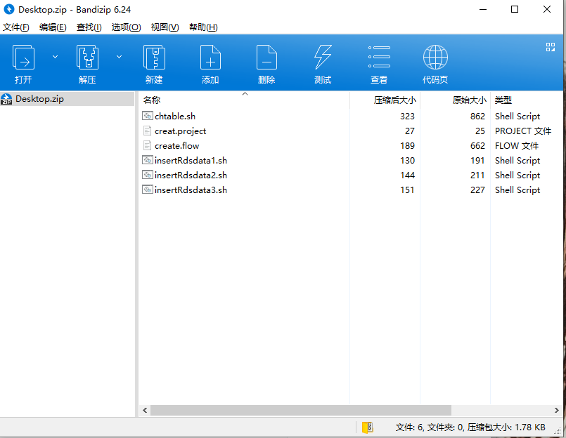

# Azkaban执行Sqoop任务

## 方式一：

将sqoop写入Shell脚本

```
#!/bin/bash
source /etc/profile
sqoop import \
--connect jdbc:mysql://hadoop001:3306/sales_source \
--username root \
--password 123456 \
--table sales_order \
--hive-import \
--fields-terminated-by '','' \
--hive-table sales_rds.sales_order
```

<font color="red">注意：这个shell脚本的格式不仅要是utf8还要是Linux下的utf8格式，这两者的换行符是不一样的</font>

普通的utf8报错

```
26-09-2019 04:54:36 CST sqoop INFO - sqoop.sh: line 2: /etc/profile
26-09-2019 04:54:36 CST sqoop INFO - : 没有那个文件或目录
26-09-2019 04:54:36 CST sqoop INFO - sqoop.sh: line 3: sqoop: command not found
26-09-2019 04:54:36 CST sqoop INFO - sqoop.sh: line 4: --connect: command not found
26-09-2019 04:54:36 CST sqoop INFO - sqoop.sh: line 5: --username: command not found
26-09-2019 04:54:36 CST sqoop INFO - sqoop.sh: line 6: --password: command not found
26-09-2019 04:54:36 CST sqoop INFO - sqoop.sh: line 7: --table: command not found
26-09-2019 04:54:36 CST sqoop INFO - sqoop.sh: line 8: --hive-import: command not found
26-09-2019 04:54:36 CST sqoop INFO - sqoop.sh: line 9: --fields-terminated-by: command not found
26-09-2019 04:54:36 CST sqoop INFO - sqoop.sh: line 10: --hive-table: command not found
26-09-2019 04:54:36 CST sqoop INFO - Process completed unsuccessfully in 0 seconds.
```

用notepad++更改相应格式或者把写好的脚本放在linux上vi一下再拉到windows上传。

**嫌麻烦用下面这样的方式**

## 方式二

.project文件

```
azkaban-flow-version: 2.0
```

.flow

```
nodes:
  - name: insert_RDS_sales_order_data 
    type: command
    config:
      command: /opt/moudle/sqoop/bin/sqoop --options-file insertRdsdata.sh
```

 command: /opt/moudle/sqoop/bin/sqoop --options-file insertRdsdata.sh 必须指到sqoop安装目录

也可以用job文件

```
type: command
command: /opt/moudle/sqoop/bin/sqoop --options-file insertRdsdata.sh
```

insertRdsdata.sh(后缀名随意的)。属性和值之间必须换行

```
import
--connect
jdbc:mysql://hadoop001:3306/sales_source
--username
root
--password
123456
--table
sales_order
--hive-import
-m
1
--fields-terminated-by 
','
--hive-overwrite
--hive-table
sales_rds2.sales_order
```

1. 打成zip包，注意编码utf-8。

   我这里拿我的一个测试样例举例的。

   

2. azkaban新建一个任务

3. 上传这个zip包

4. 执行就好

   ​	