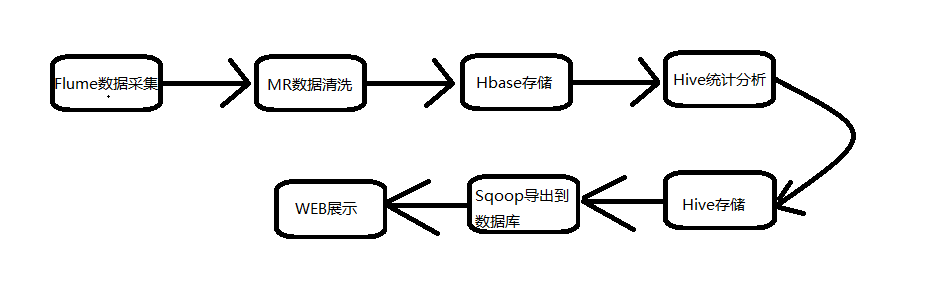

# Flume

## 介绍

- Flume是什么

  是一个分布式的高效的海量日志数据收集工具。
  是一个分布式、可靠、可用的高效的日志数据收集、聚合、移动的工具。

- Hadoop总体的业务流程



- 特点以及优势
  1. Fulme可以将数据存储到任何集中的存储器中，比如HDFS、HBase
  2. 可以对数据生产者和数据接收容器之间做个均衡，保证二者的平衡。
  3. Flume的管道是基于事务的，保证了数据在传输和接收时的一致性。
  4. Flume是可靠的、容错性高的、可升级的、易管理的并且可定制的。
  
- 为什么用Flume

  ​	我们有这么一个需求。

  问：要将公司收集到的本地数据上传到HDFS上(后面的过程先不论)，而这个数据可能是很大的。我们可以怎么做？

  答：能等数据都准备好了，然后我们put上我们的HDFS上

  问：如果好多数据是不需要的,我们只要我们需要的那一部分？或者我们需要对数据进行某种格式化处理？

  答：那我们手写一个MR程序自定义一个InputFormat。用MR来读数据然后Map阶段处理一下再写入HDFS?

  问：那如果数据量太大(爬虫残生)？没法等数据都准备好再存HDFS上呢？或者这些数据我需要很快的让web页面展示出来，怎么处理呢？

  答：。。。？

  ​	这就是为什么要用Flume这样的工具，Flume可以实时的抽取本地数据，目标文件一旦变化就会将变化的数据抽取出来然后写出去。

## 工作原理

### 数据流模型


#### Event(封装数据的对象)

官网这样介绍Event:

An `Event` is a unit of data that flows through a Flume agent. The `Event`flows from `Source` to `Channel`to `Sink`, and is represented by animplementation of the `Event` interface. An `Event` carries a payload (byte
array) that is accompanied by an optional set of headers (string attributes).

翻译：

```
Event是一个Flume agent传递数据的基本单位。Event从Source流入到Channel再流入到Sink，是通过Event接口的实现类体现的。Event是由一个Headers和一个字节数组组成。
```

可以理解为，Event就是Agent的传输数据的数据类型，将收到的数据封装起来。往往正式工作的是一个实现了Event接口的对象。而这个对象是由一个头信息(描述信息)和一个字节数组(传输的数据)组成的。

`由上可得下面这样得模型`


#### Agent

一个Agent是Flume分布式系统最核心的角色，Flume采集系统就是由一个个agent所连接起来的。

而一个Agent是由一个Source、一个或多个Channel和Sink组成的。

##### Source

数据接受组件，接受来自外部的数据，然后封装`格式化`成Event形式传输个一个或者多个Channel。

Flume提供了很多Source的实现来应对各种输入数据类型，并且可以自定义字节的Source。

##### Channel

一个临时存放Event的地方。存放的形式可以是存在内存中，也可以存在磁盘上。知道Sink处理完这个Event.

##### Sink

从Channel中取出Event然后将其中的数据写入到别的Agent中或者是文件系统、数据库中。

#### Flume 部署模式

#### 单一模式


#### 多代理

这只是一种实现形式，我们Sink的数据不止可以写到文件系统或者数据库，还可以是下一个Agent。

这种实现形式是下面所有拓扑结构的基础。


#### 聚合

当我们的服务多的是，一个Agent负责一个服务的日志采集，多个服务如果同时向HDFS写的时候往往不好统一，比如名称难以规范。这时可以通过这样的模式，用一个Agent来统一处理其他Agent Sink出来的数据，然后统一格式写到目标文件系统或者数据库中。


#### 负载均衡


#### 多路复用

当我们的服务产生的数据复杂多样的时候，可以这样做。在一个Agent内部将这些数据分开，然后传输到不同的文件系统上。当然也可以串接Agent再做需要的处理。


## plugin

- interceptor

  拦截器，作用于source阶段，用于过滤数据

- selectorer

  选择器，作用于source阶段，

