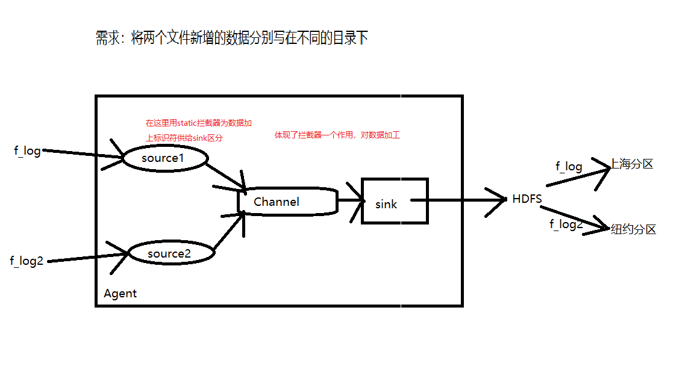
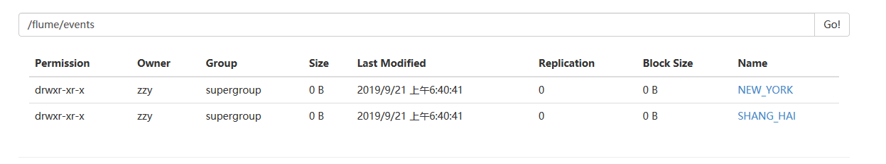
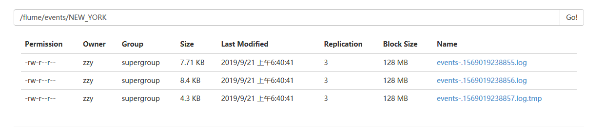
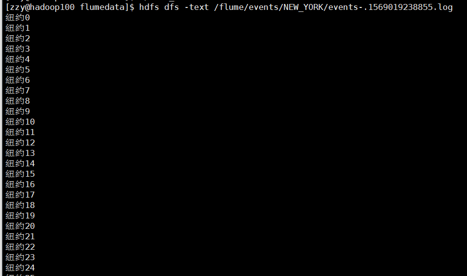

# Flume使用

### exec可配置项(官网搬过来的)

```\
Name 	            Default 	Description
channels 	        – 	 
type 	            – 	        组件类型，必须是exec
command 	        – 	        要执行的指令
shell   	        – 	        A shell invocation used to run the command. e.g. /bin/sh -c. Required only for commands relying on shell features like wildcards, back ticks, pipes etc.
restartThrottle 	10000 	    重启的等待时间，单位是毫秒
restart 	        false   	如果这个agent挂了，是否重启
logStdErr 	        false   	是否将执行记录执行的错误信息
batchSize 	        20 	        每次向channle写数据的最大行数
batchTimeout 	    3000    	数据下沉之前，如果buffer还没填满,等待的时间(毫秒)
```

### HDFS Sink了可配置项

```
type 	                    – 	         组件的类型，必须是hdfs
hdfs.path       	        – 	         在hdfs上的路径
hdfs.filePrefix 	        FlumeData 	 flum自动创建的文件名的前缀
hdfs.fileSuffix 	        – 	         flum自动创建的文件名的后缀
hdfs.inUsePrefix 			– 			 被开启(这样讲是为了方便理解maxOpenFiles)的文件的前缀
hdfs.inUseSuffix 			.tmp 		 被开启的文件的后缀
hdfs.rollInterval   	    30 	         根据时间间隔(秒)滚动文件(如果设置为0表示永远不会因为时间间隔滚动)
hdfs.rollSize       	    1024 	     根据字节数的大小滚动文件(如果设置为0永远不会因为字节大小滚动)
hdfs.rollCount 	            10      	 根据event数量滚动文件 (设置为0永远不会因为event数量滚动文件)
hdfs.idleTimeout    	    0 	         超时多久以后关闭无效的文件。(0 = 禁用自动关闭的空闲文件)
hdfs.batchSize 	            100     	 一次写到HDFS上的events数量
hdfs.codeC             	    – 	         其中的一种压缩格式 : gzip, bzip2, lzo, lzop, snappy
hdfs.fileType       	    SequenceFile 文件格式:  SequenceFile, DataStream 或者 CompressedStream (1)DataStream 不能压缩，设置了就不要设置codeC (2)CompressedStream 需要提前设置codeC
hdfs.maxOpenFiles   	    5000 	     允许打开的最大文件数，如果超过它，旧的文件将会被关闭
hdfs.minBlockReplicas 	    – 	         写入HDFS的最小副本数. 如果不指定，就用hadoop默认的
hdfs.writeFormat 	        Writable 	 写出文件数据的格式. 在使用flume创建DataStream文件之前设置为Test, 否则这些文件就不能被Apache Impala (incubating)和hive正确读取.
hdfs.threadsPoolSize 	    10 	         每个HDFS sink的HDFS的IO操作线程数
hdfs.rollTimerPoolSize 	    1 		     每个HDFS sink调度定时文件滚动的线程数。
hdfs.kerberosPrincipal 	    – 	         每个HDFS sink的HDFS的IO操作线程数
hdfs.kerberosKeytab 	    – 	         每个HDFS sink的HDFS的IO操作线程数
hdfs.proxyUser 	  	     
hdfs.round 	                false   	 时间戳应该被四舍五入。(如果为true，会影响所有的时间，除了t%)
hdfs.roundValue        	    1 	         四舍五入的最高倍数（单位配置在hdfs.roundUnit），但是要小于当前时间。
hdfs.roundUnit      	    second 	     四舍五入的单位：second, minute or hour.
hdfs.timeZone       	    Local Time 	 时区的名称
hdfs.useLocalTimeStamp 	    false   	 使用本地时间替换转意字符 (替换event header里面的时间戳))
hdfs.closeTries 	        0 	         尝试关闭文件(体现出的形式是重命名)的次数. 如果设置为1，就不会再尝试关闭文件(比如由于namenode或者datanode故障关闭失败)), 然后这个未关闭的文件一直会以开启的状态(.tmp结尾)留着. 如果设置为0，就会一直尝试关闭这个文件直到成功.如果一个文件始终未被关闭成功，这些数据会被保存，直到Flume重启才会被关闭。
hdfs.retryInterval      	180 	     关闭文件重试的间隔. 设置为0表示不重试。
```

### Memory Channel可配置项

| Name                         | Default | Description                                                  |
| ---------------------------- | ------- | ------------------------------------------------------------ |
| **type**(必填)               | -       | 必须是memory                                                 |
| capacity                     | 100     | Channel最大能存储的event数量                                 |
| transactionCapacity          | 100     | Channel一次从source拉取或者一次能给sink的event的最大数量     |
| keep-alive                   | 3       | 添加或移除一个event的超时时间(秒)                            |
| byteCapacityBufferPercentage | 20      | 定义byteCapacity与所有events容量之间缓冲区的百分比。         |
| byteCapacity                 |         | channel中所有events所占空间的最大字节数。<br />只计算event的body部分。默认是虚拟机空间的80%。如果是多个channel指向一个source,event的容量会重复计算也就是有多个相同的channel算的时候也是多个的和。如果设置为0大约等于200GB |


### 例一：监听文件变动，并写入HDFS

```
# 三组件定义
# a1 为agent的名字
a1.sources = r1
a1.sinks = k1
a1.channels = c1

# 定义source r1(数据输入源)
a1.sources.r1.type = exec
# exec执行的指令
a1.sources.r1.command = tail -F /home/zzy/f_log

a1.sinks.k1.type = hdfs	# 定义sink k1(数据输出源)
# 定义文件路径
a1.sinks.k1.hdfs.path = /flume/events/%y-%m-%d
# 定义生产的文件名前缀
a1.sinks.k1.hdfs.filePrefix = flume_events-
# 两个events就写一个文件
a1.sinks.k1.hdfs.rollCount = 2
# 让写出的数据直接是字符串
a1.sinks.k1.hdfs.fileTyep = DataStream
a1.sinks.k1.hdfs.writeFormat = text
a1.sinks.k1.hdfs.round = true
a1.sinks.k1.hdfs.roundValue = 1
a1.sinks.k1.hdfs.roundUnit = second
a1.sinks.k1.hdfs.useLocalTimeStamp = true

# 定义channel c1
# 数据缓存在内存
a1.channels.c1.type = memory
# 最多可以缓存1000个event
a1.channels.c1.capacity = 1000
# 一次source传来或者sink拉取的event的最大数量
a1.channels.c1.transactionCapacity = 100

# 组装source channel  sink
a1.sources.r1.channels = c1
a1.sinks.k1.channel = c1
```

<font color="blue">**更多的基础配置信息参考官网~**</font>

### 例二：static拦截器使用

**设计结构**



```
# 定义agent
a1.sources=r1 r2
a1.channels=c1
a1.sinks=s1

# 组装source channel  sink
a1.sources.r1.channels=c1
a1.sources.r2.channels=c1
a1.sinks.s1.channel=c1

# 定义第一个source
a1.sources.r1.type=exec
a1.sources.r1.command= tail -f /home/zzy/flumedata/f_log
a1.sources.r1.interceptors = i1
# 装配static拦截器，在event的header中为数据添加一个k-v对
a1.sources.r1.interceptors.i1.type = static
a1.sources.r1.interceptors.i1.key =city
a1.sources.r1.interceptors.i1.value = SHANG_HAI

# 定义第二个source
a1.sources.r2.type=exec
a1.sources.r2.command= tail -f /home/zzy/flumedata/f_log2
a1.sources.r2.interceptors = i2
# 装配拦截器
a1.sources.r2.interceptors.i2.type = static
a1.sources.r2.interceptors.i2.key = city
a1.sources.r2.interceptors.i2.value = NEW_YORK

# 设置channel
a1.channels.c1.type=memory
a1.channels.c1.capacity=100000
a1.channels.c1.transactionCapacity=100000

# 配置sink
a1.sinks.s1.type = hdfs
# 通过用source阶段添加的city键的值来创建目录
a1.sinks.s1.hdfs.path = /flume/events/%{city}
a1.sinks.s1.hdfs.filePrefix = events-
a1.sinks.s1.hdfs.fileSuffix =.log
a1.sinks.s1.hdfs.inUseSuffix =.tmp
a1.sinks.s1.hdfs.rollInterval = 0
a1.sinks.s1.hdfs.rollSize = 0
a1.sinks.s1.hdfs.rollCount = 800
a1.sinks.s1.hdfs.batchSize = 800
a1.sinks.s1.hdfs.fileType=DataStream
a1.sinks.s1.hdfs.writeFormat=Text
a1.sinks.s1.hdfs.round = true
a1.sinks.s1.hdfs.roundValue = 1
a1.sinks.s1.hdfs.roundUnit = minute
a1.sinks.s1.hdfs.useLocalTimeStamp=false
```

**效果**







### 例三：flume的分布式(host拦截器使用)

**设计结构**


```
# hadoop001 和hadoop002上的agent
a1.sources=r1
a1.channels=c1
a1.sinks=s1

a1.sources.r1.channels=c1
a1.sinks.s1.channel=c1

a1.sources.r1.type=exec
a1.sources.r1.command= tail -f /home/zzy/flumedata/f_log
a1.sources.r1.interceptors = i1
# 通过host将ip地址存入event的header中
a1.sources.r1.interceptors.i1.type = host
a1.sources.r1.interceptors.i1.hostHeader = hostname #这是取ip的意思不是主机名
a1.sources.r1.interceptors.i1.preserveExisting=true #如果这个字段存在就不覆盖

a1.channels.c1.type=memory
a1.channels.c1.capacity=100000
a1.channels.c1.transactionCapacity=100000

# 数据下沉的地方是一个agent
a1.sinks.s1.type = avro
# 配置agent的地址
a1.sinks.s1.hostname=hadoop003
# 配置端口号
a1.sinks.s1.port=6666
```

```
# hadoop003上的agent
a1.sources=r1
a1.channels=c1
a1.sinks=s1

a1.sources.r1.channels=c1
a1.sinks.s1.channel=c1

a1.sources.r1.type=avro
a1.sources.r1.bind=hadoop003
a1.sources.r1.port=6666


a1.channels.c1.type=memory
a1.channels.c1.capacity=100000
a1.channels.c1.transactionCapacity=100000

a1.sinks.s1.type = hdfs
a1.sinks.s1.hdfs.path = /flume/events/%{hostname}
a1.sinks.s1.hdfs.filePrefix = events-
a1.sinks.s1.hdfs.fileSuffix =.log
a1.sinks.s1.hdfs.inUseSuffix =.tmp
a1.sinks.s1.hdfs.rollInterval = 0
a1.sinks.s1.hdfs.rollSize = 0
a1.sinks.s1.hdfs.rollCount = 800
a1.sinks.s1.hdfs.batchSize = 800
a1.sinks.s1.hdfs.fileType=DataStream
a1.sinks.s1.hdfs.writeFormat=Text
a1.sinks.s1.hdfs.round = true
a1.sinks.s1.hdfs.roundValue = 1
a1.sinks.s1.hdfs.roundUnit = minute
a1.sinks.s1.hdfs.useLocalTimeStamp=false
```

测试效果

