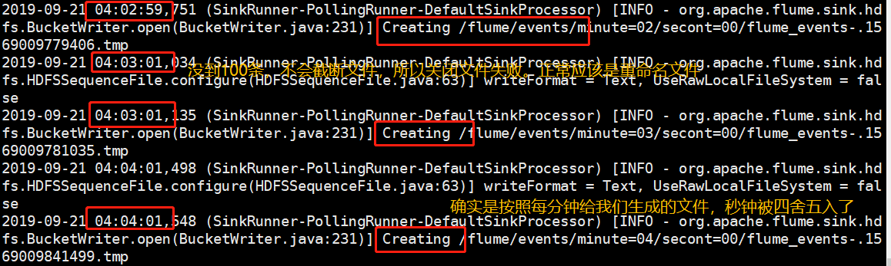
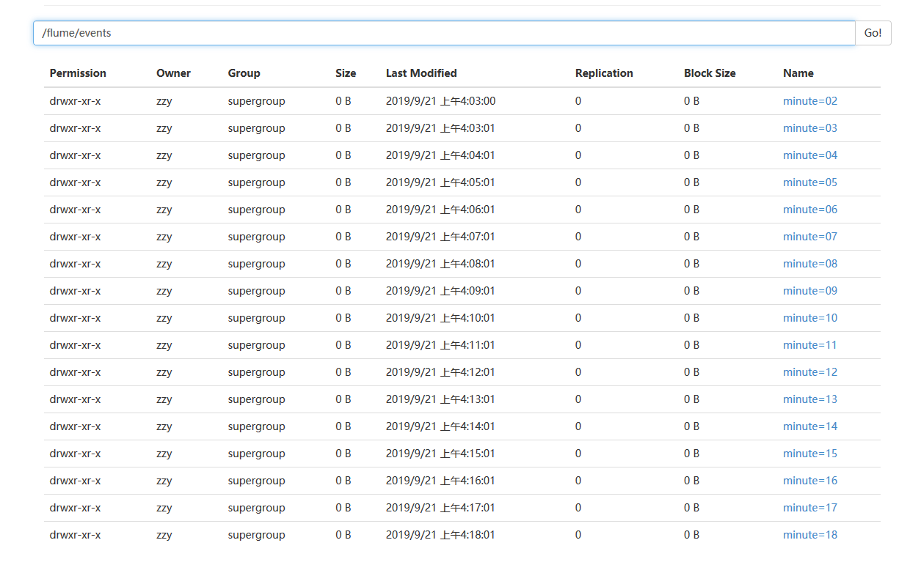
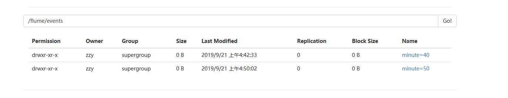

# 如何理解Flume hdfs sink的roll和round

## roll相关

<font color="red">**roll相关的字段作用对象是文件**</font>

| 字段         | 默认值 | 说明                                                         |
| ------------ | ------ | ------------------------------------------------------------ |
| rollInterval | 30     | 每隔30秒截断一个文件。设置为0表示不会因为时间间隔截断文件    |
| rollSize     | 1024   | 文件字节数超过1024截断一个文件。设置为0就不因为文件大小截断文件 |
| rollCount    | 10     | 每10个event截断一个文件。设置为0就不因为event数量截断文件    |

别的都好理解。就一个event的需要说一下。

#### 什么是event？

event的官方解释是agent最小的传输单位。

**举个例子**

```
以tail -f (采集文件变化信息)一个文件为例子
我们像被采集文件里追加(新增)三条数据就算三个event
```

## round相关

<font color="red">**round相关的字段作用对象是时间戳**</font>

[时间戳格式](http://flume.apache.org/releases/content/1.9.0/FlumeUserGuide.html#hdfs-sink) 进去搜索HDFS Sink

| 字段       | 默认值 | 说明                                 |
| ---------- | ------ | ------------------------------------ |
| round      | false  | 时间戳需不需要四舍五入(不影响%t)     |
| roundValue | 1      | 时间戳四舍五入的倍数，要小于当前时间 |
| roundUnit  | second | 时间戳四舍五入的单位                 |

光看翻译就觉得很难以理解。

### **举个例子**

```shell
# 追加数据脚本。每秒向f_log内追加一条数据，这样会跑15分钟
for((i=0;i<900;i++));
do
echo "test data:"$i >> f_log
sleep 1
done
rm -rf f_log
touch f_log
```

```
a1.sources = r1
a1.sinks = k1
a1.channels = c1

a1.sources.r1.type = exec
a1.sources.r1.command = tail -f /home/zzy/f_log

a1.sinks.k1.type = hdfs
# 这里我们分别根据分钟和秒数来创建文件夹。
a1.sinks.k1.hdfs.path = /flume/events/%M/%S
a1.sinks.k1.hdfs.filePrefix = flume_events-
# 每100行生成一个文件
# 这里我们1秒一条数据1分钟一个文件夹。所有估算一下一个文件最多写60条数据到不了100
a1.sinks.k1.hdfs.rollCount = 100
a1.sinks.k1.hdfs.rollInterval = 0
a1.sinks.k1.hdfs.rollSize = 0
a1.sinks.k1.hdfs.fileTyep = DataStream
a1.sinks.k1.hdfs.writeFormat = Text
# 下面再解释这些
a1.sinks.k1.hdfs.round = true
a1.sinks.k1.hdfs.roundValue = 1
a1.sinks.k1.hdfs.roundUnit = minute
a1.sinks.k1.hdfs.useLocalTimeStamp=true


a1.channels.c1.type = memory
a1.channels.c1.capacity = 10000
a1.channels.c1.transactionCapacity = 10000


a1.sources.r1.channels = c1
a1.sinks.k1.channel = c1

```

如果不管round相关的设置。我们根据设置应该是每分钟一个文件夹，每个分钟文件夹里面以秒再分割成60个文件夹，每个文件夹里面存着每秒采集来的数据(理想状态)。

但是加上round相关，实际就会是这样的：

我们先来翻译一下这个

```
a1.sinks.k1.hdfs.round = true
a1.sinks.k1.hdfs.roundValue = 1
a1.sinks.k1.hdfs.roundUnit = minute

我们打算对时间戳根据分钟以每1分钟为单位进行四舍五入。
```

到达的效果：假设我们job开始的时间是11点49分24秒，根据分钟四舍五入是11点49分00秒



<font color="red">flume里重命名就代表关闭文件(因为.tmp的临时文件叫打开的文件--正在被写，更名完---去掉.tmp就不会再写了)</font>



确实生成了很多以分钟开头的目录。再查看一下数据

```
[zzy@hadoop001 ~]$hdfs dfs -text /flume/events/minute=05/secont=00/flume_events-.1569009901514

1569009901600	test data:120
1569009901600	test data:121
。
。中间省略
。
1569009958532	test data:178
1569009958532	test data:179

120-179 60条记录。确实是近1分钟的数据都在写这个文件了。
```

### 再举个例子

如果我们把round相关改成

```
a1.sinks.k1.hdfs.round = true
a1.sinks.k1.hdfs.roundValue = 10
a1.sinks.k1.hdfs.roundUnit = minute
```

猜想一下还是那份数据。

1. 只会生成两个分钟文件夹(每10分钟一个文件夹，15分钟的追加就两个文件夹)
2. 每个分钟文件夹下面有一个秒钟文件夹
3. 每个秒钟文件夹下面有多个文件。每个文件100行数据(理想状态)

测试结果



```
[zzy@hadoop001 ~]$hdfs dfs -text /flume/events/minute=40/secont=00/flume_events-.1569012152239

1569012352990	test data:200
1569012352992	test data:201
.
. 中间太多省略了。确实是100条
.
1569012452025	test data:298
1569012452025	test data:299
```

